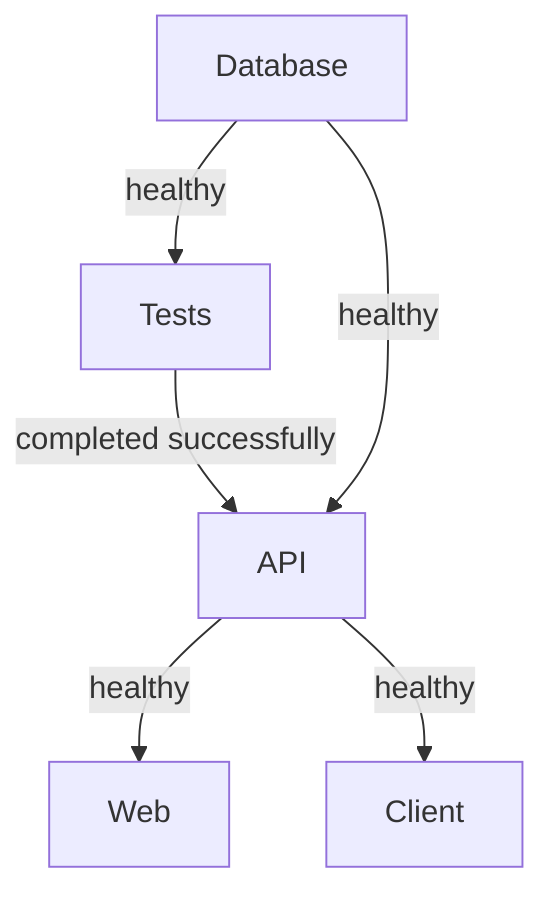

# Firmeza Docker Deployment Guide

This guide explains how to deploy the complete Firmeza infrastructure using Docker with automated testing.

## Prerequisites

- Docker Desktop installed and running
- Docker Compose V2 (included with Docker Desktop)
- At least 4GB of RAM available for Docker
- Internet connection for pulling base images

## Quick Start

Deploy the entire stack with test-first validation:

```bash
docker-compose up --build
```

This command will:
1. ✅ Start PostgreSQL database
2. ✅ Run all xUnit tests
3. ✅ **Deploy services ONLY if tests pass**
4. ✅ Start API, Web Admin, and Client applications

## Architecture Overview

```
┌─────────────────────────────────────────────────┐
│              Test-First Deployment              │
└─────────────────────────────────────────────────┘
                       │
          ┌────────────▼────────────┐
          │  PostgreSQL Database    │
          │   (Port 5432)           │
          └────────────┬────────────┘
                       │
          ┌────────────▼────────────┐
          │   Firmeza.Tests         │
          │   (Must Pass)           │
          └────────────┬────────────┘
                       │
                   ✅ Success
                       │
      ┌────────────────┼────────────────┐
      │                │                │
┌─────▼─────┐    ┌────▼────┐    ┌──────▼──────┐
│  API      │    │  Web    │    │   Client    │
│ Port 5000 │    │Port 5001│    │  Port 3000  │
└───────────┘    └─────────┘    └─────────────┘
```

## Services

| Service | Port | Description |
|---------|------|-------------|
| **db** | 5432 | PostgreSQL 15 database |
| **tests** | - | xUnit test runner (exits after completion) |
| **api** | 5000 | ASP.NET Core REST API |
| **web** | 5001 | Razor Pages admin dashboard |
| **client** | 3000 | React SPA (via Nginx) |

## Deployment Commands

### Full Deployment (Recommended)
```bash
docker-compose up --build
```

### Run in Background
```bash
docker-compose up --build -d
```

### View Logs
```bash
# All services
docker-compose logs -f

# Specific service
docker-compose logs -f api
docker-compose logs -f tests
```

### Stop All Services
```bash
docker-compose down
```

### Stop and Remove Volumes (Clean Reset)
```bash
docker-compose down -v
```

## Test-First Deployment

The orchestration ensures quality:

1. **Database starts first** with health checks
2. **Tests run automatically** against the database
3. **If tests fail**: Deployment stops, no services start
4. **If tests pass**: API → Web → Client deploy in sequence
5. **Health checks** ensure services are ready before proceeding

### Viewing Test Results

Tests run automatically. View results:
```bash
docker-compose logs tests
```

### Running Tests Only

To run just the tests without deploying:
```bash
docker-compose up tests
```

### Skipping Tests (Not Recommended)

To start services without tests:
```bash
docker-compose up api web client db
```

## Environment Variables

Configure in `docker-compose.yml`:

### Database
- `POSTGRES_DB`: Database name (default: FirmezaDb)
- `POSTGRES_USER`: Database user (default: postgres)  
- `POSTGRES_PASSWORD`: Database password

### API
- `ConnectionStrings__DefaultConnection`: Database connection
- `Jwt__Key`: JWT signing key (must be 32+ characters)
- `Jwt__Issuer`: JWT issuer
- `Jwt__Audience`: JWT audience
- `ASPNETCORE_ENVIRONMENT`: Environment (Production/Development)

## Accessing the Applications

Once deployed successfully:

| Application | URL | Credentials |
|-------------|-----|-------------|
| **API** | http://localhost:5000 | - |
| **API Swagger** | http://localhost:5000/swagger | - |
| **Admin Web** | http://localhost:5001 | admin / Admin123! |
| **Client App** | http://localhost:3000 | customer / Customer123! |
| **Database** | localhost:5432 | postgres / your_password |

## Health Checks

The orchestration uses health checks to ensure service readiness:

### API Health Check
```bash
curl http://localhost:5000/health
```

Expected response: `Healthy`

### Service Dependencies



## Troubleshooting

### Tests Failing

1. **View test output**:
   ```bash
   docker-compose logs tests
   ```

2. **Check database connection**:
   ```bash
   docker-compose logs db
   ```

3. **Run tests locally** (if dotnet installed):
   ```bash
   cd Firmeza.Tests
   dotnet test
   ```

### Services Not Starting

1. **Check service logs**:
   ```bash
   docker-compose logs <service-name>
   ```

2. **Verify health status**:
   ```bash
   docker ps
   ```

3. **Rebuild images**:
   ```bash
   docker-compose build --no-cache
   docker-compose up
   ```

### Port Conflicts

If ports are already in use:

1. **Stop conflicting services**
2. **Or modify ports in `docker-compose.yml`**:
   ```yaml
   ports:
     - "5050:5000"  # External:Internal
   ```

### Database Issues

1. **Reset database**:
   ```bash
   docker-compose down -v
   docker-compose up --build
   ```

2. **Access database directly**:
   ```bash
   docker exec -it firmeza-postgres psql -U postgres -d FirmezaDb
   ```

## Development Workflow

### Making Changes

1. **Update code**
2. **Run tests locally** (optional):
   ```bash
   dotnet test
   ```
3. **Rebuild and deploy**:
   ```bash
   docker-compose up --build
   ```

### Watching Logs During Development

```bash
docker-compose up --build | grep -E '(tests|api|web|client)'
```

## Production Considerations

### Security

1. **Change default passwords** in docker-compose.yml
2. **Use environment files** instead of hardcoded values:
   ```bash
   # Create .env file
   POSTGRES_PASSWORD=securepassword
   JWT_KEY=your-production-key
   ```

3. **Update CORS settings** for production domains

### Performance

1. **Resource limits** (add to services):
   ```yaml
   deploy:
     resources:
       limits:
         cpus: '0.50'
         memory: 512M
   ```

2. **Enable production optimizations** in Dockerfiles

### Persistence

Database data persists in Docker volume: `postgres_data`

Backup:
```bash
docker exec firmeza-postgres pg_dump -U postgres FirmezaDb > backup.sql
```

Restore:
```bash
docker exec -i firmeza-postgres psql -U postgres FirmezaDb < backup.sql
```

## CI/CD Integration

### GitHub Actions Example

```yaml
name: Deploy

on: [push]

jobs:
  deploy:
    runs-on: ubuntu-latest
    steps:
      - uses: actions/checkout@v2
      - name: Build and test
        run: docker-compose up --build --abort-on-container-exit tests
      - name: Deploy if tests pass
        run: docker-compose up -d api web client
```

### GitLab CI Example

```yaml
stages:
  - test
  - deploy

test:
  stage: test
  script:
    - docker-compose up --build tests

deploy:
  stage: deploy
  script:
    - docker-compose up -d api web client
  only:
    - main
```

## Additional Commands

### Remove All Firmeza Containers
```bash
docker-compose down --remove-orphans
```

### View Resource Usage
```bash
docker stats
```

### Clean Docker System
```bash
docker system prune -a
```

## Support

For issues or questions:
- Check logs: `docker-compose logs`
- Review test output
- Verify environment variables
- Ensure Docker has sufficient resources
